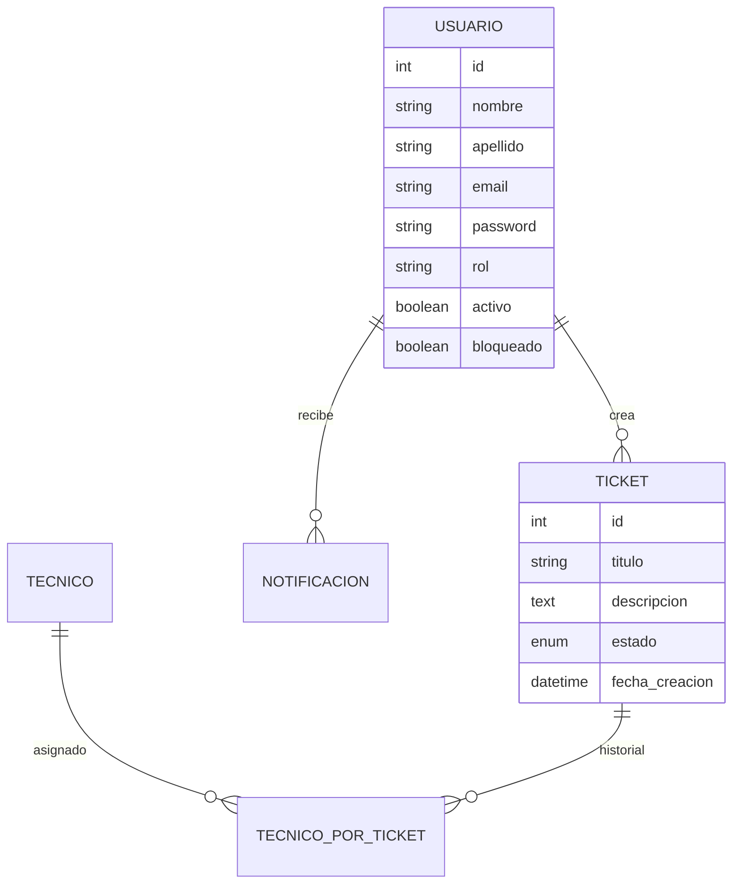
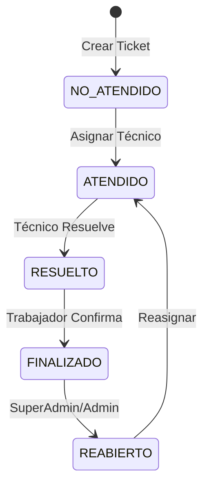

# 🎫 ApiTickets - Sistema de Gestión de Tickets

<div align="center">


**Sistema completo de gestión de tickets para soporte técnico con arquitectura moderna y escalable**

[Características](#-características) • [Instalación](#-instalación) • [API Reference](#-api-reference) • [Arquitectura](#-arquitectura)

</div>

---

## 📋 Descripción

**ApiTickets** es un sistema robusto de gestión de tickets diseñado para organizaciones que necesitan un control eficiente de sus solicitudes de soporte técnico. Construido con **Spring Boot** y **MySQL**, ofrece una arquitectura escalable con autenticación JWT y un sistema de roles jerárquico.

### 🎯 Problema que Resuelve

- **Desorganización** en el manejo de solicitudes de soporte
- **Falta de trazabilidad** en la resolución de incidencias
- **Ausencia de roles y permisos** claros
- **Dificultad para generar reportes** y estadísticas

### 💡 Solución Ofrecida

Un sistema centralizado que permite gestionar tickets desde su creación hasta su resolución, con roles diferenciados, notificaciones automáticas y reportes en tiempo real.

---

## ✨ Características

### 🔐 **Sistema de Autenticación Avanzado**

- Autenticación JWT segura con tokens de larga duración
- Cambio obligatorio de contraseña en primer acceso
- Sistema de reset de contraseñas por administradores

### 👥 **Gestión de Usuarios Jerárquica**

- **SuperAdmin**: Dueño del sistema con acceso total
- **Admin**: Gestión de usuarios y tickets del sistema
- **Técnico**: Resolución y gestión de tickets asignados
- **Trabajador**: Creación y seguimiento de tickets propios

### 🎫 **Gestión Completa de Tickets**

- Creación, asignación y seguimiento de tickets
- Estados automáticos: `NO_ATENDIDO` → `ATENDIDO` → `RESUELTO` → `FINALIZADO`
- Posibilidad de reapertura con comentarios
- Historial completo de cambios y asignaciones

### 🔔 **Sistema de Notificaciones**

- Notificaciones automáticas por cambios de estado
- Alertas por asignación de tickets
- Notificaciones de bloqueo y desbloqueo de usuarios

### 📊 **Reportes y Estadísticas**

- Métricas de rendimiento por técnico
- Estadísticas de tickets por estado y período
- Reportes de usuarios activos y bloqueados
- Dashboard de administración con KPIs

### 🛡️ **Seguridad y Auditoría**

- Logs automáticos de todas las acciones
- Sistema de marcas por fallos técnicos
- Bloqueo automático por exceso de fallos
- Trazabilidad completa de cambios

---

## 🚀 Instalación

### Prerrequisitos

```bash
# Verificar versiones
java --version    # Java 17+
mvn --version     # Maven 3.8+
mysql --version   # MySQL 8.0+
```

### 1️⃣ Configuración de Base de Datos

```sql
-- Crear base de datos
CREATE DATABASE apiticket;

-- Ejecutar script de inicialización
source init_ticket_system.sql;
```

### 2️⃣ Configuración del Proyecto

```bash
# Clonar repositorio
git clone https://github.com/Akc9912/apiTickets.git
cd apiTickets

# Configurar variables de entorno
cp .env.example .env
```

**Variables de entorno (.env):**

```properties
DB_URL=jdbc:mysql://localhost:3306/apiticket?useSSL=false&serverTimezone=UTC
DB_USER=root
DB_PASS=tu_password_mysql
JWT_SECRET=claveSuperSecreta12345678901234567890
APP_DEFAULT_PASSWORD=123456
```

### 3️⃣ Compilación y Ejecución

```bash
# Compilar proyecto
mvn clean compile

# Ejecutar en desarrollo
mvn spring-boot:run

# O generar JAR y ejecutar
mvn clean package
java -jar target/miapi-0.0.1-SNAPSHOT.jar
```

### 4️⃣ Credenciales por Defecto

```
🔑 SuperAdmin por defecto:
   Email: superadmin@sistema.com
   Password: secret

⚠️ IMPORTANTE: Cambiar contraseña después del primer login
```

---

## 🌐 API Reference

### 🔐 **Autenticación**

| Método | Endpoint                       | Descripción          | Rol Requerido |
| ------ | ------------------------------ | -------------------- | ------------- |
| `POST` | `/api/auth/login`              | Iniciar sesión       | Público       |
| `POST` | `/api/auth/cambiar-password`   | Cambiar contraseña   | Autenticado   |
| `POST` | `/api/auth/reiniciar-password` | Reiniciar contraseña | Admin+        |

### 👑 **SuperAdmin Endpoints**

| Método   | Endpoint                                       | Descripción                     |
| -------- | ---------------------------------------------- | ------------------------------- |
| `GET`    | `/api/superadmin/usuarios`                     | Listar todos los usuarios       |
| `POST`   | `/api/superadmin/usuarios`                     | Crear usuario de cualquier tipo |
| `PUT`    | `/api/superadmin/usuarios/{id}/promover-admin` | Promover usuario a Admin        |
| `PUT`    | `/api/superadmin/usuarios/{id}/degradar-admin` | Degradar Admin a Trabajador     |
| `GET`    | `/api/superadmin/estadisticas/sistema`         | Estadísticas completas          |
| `PUT`    | `/api/superadmin/tickets/{id}/reabrir`         | Reabrir ticket cerrado          |
| `DELETE` | `/api/superadmin/tickets/{id}`                 | Eliminar ticket                 |

### 👨‍💼 **Admin Endpoints**

| Método | Endpoint                            | Descripción              |
| ------ | ----------------------------------- | ------------------------ |
| `GET`  | `/api/admin/usuarios`               | Listar usuarios no-admin |
| `POST` | `/api/admin/usuarios`               | Crear Técnico/Trabajador |
| `PUT`  | `/api/admin/usuarios/{id}/bloquear` | Bloquear usuario         |
| `GET`  | `/api/admin/tickets`                | Gestionar tickets        |

### 🎫 **Tickets**

| Método | Endpoint                      | Descripción        | Rol Requerido |
| ------ | ----------------------------- | ------------------ | ------------- |
| `GET`  | `/api/tickets`                | Listar mis tickets | Trabajador+   |
| `POST` | `/api/tickets`                | Crear ticket       | Trabajador+   |
| `PUT`  | `/api/tickets/{id}/resolver`  | Resolver ticket    | Técnico       |
| `PUT`  | `/api/tickets/{id}/finalizar` | Finalizar ticket   | Trabajador    |

### 🔔 **Notificaciones**

| Método | Endpoint                                | Descripción        |
| ------ | --------------------------------------- | ------------------ |
| `GET`  | `/api/notificaciones?userId={id}`       | Ver notificaciones |
| `PUT`  | `/api/notificaciones/{id}/marcar-leida` | Marcar como leída  |

### 📊 **Estadísticas**

| Método | Endpoint                     | Descripción          | Rol Requerido |
| ------ | ---------------------------- | -------------------- | ------------- |
| `GET`  | `/api/estadisticas/tickets`  | Stats de tickets     | Admin+        |
| `GET`  | `/api/estadisticas/tecnicos` | Performance técnicos | Admin+        |

---

## 🏗️ Arquitectura

### 📁 Estructura del Proyecto

```
src/main/java/com/poo/miapi/
├── 🎮 controller/          # Controladores REST
│   ├── auth/              # Autenticación
│   ├── core/              # Usuarios, Tickets
│   ├── estadistica/       # Reportes
│   ├── historial/         # Auditoría
│   └── notificacion/      # Notificaciones
├── 📊 dto/                # Data Transfer Objects
├── 🗃️ model/              # Entidades JPA
├── 🔧 repository/         # Acceso a datos
├── 🛠️ service/            # Lógica de negocio
├── 🔐 security/           # Configuración JWT
└── ⚙️ config/             # Configuraciones
```

### 🗄️ Modelo de Datos



### 🔄 Flujo de Estados de Ticket



---

## 🧪 Testing

### 🔧 Pruebas con Postman

1. **Importar colección** (próximamente)
2. **Configurar ambiente:**
   ```json
   {
     "baseUrl": "http://localhost:8080",
     "token": "{{jwt_token}}"
   }
   ```

### 📝 Ejemplo de Requests

**Login:**

```json
POST /api/auth/login
{
  "email": "superadmin@sistema.com",
  "password": "secret"
}
```

**Crear Ticket:**

```json
POST /api/tickets
Authorization: Bearer {{token}}
{
  "titulo": "Error en sistema",
  "descripcion": "Descripción detallada del problema"
}
```

---

## 🐳 Despliegue

### Docker Compose

```yaml
version: "3.8"
services:
  mysql:
    image: mysql:8.0
    environment:
      MYSQL_DATABASE: apiticket
      MYSQL_ROOT_PASSWORD: root123
    ports:
      - "3306:3306"

  api:
    build: .
    depends_on:
      - mysql
    ports:
      - "8080:8080"
    environment:
      DB_URL: jdbc:mysql://mysql:3306/apiticket
```

### 📈 Escalabilidad

- **Containerización**: Docker + Docker Compose
- **Orquestación**: Kubernetes
- **Load Balancing**: Nginx/HAProxy
- **Caching**: Redis para sesiones
- **Monitoring**: Prometheus + Grafana

<div align="center">

**⭐ Si este proyecto te resulta útil, ¡dale una estrella! ⭐**

</div>
