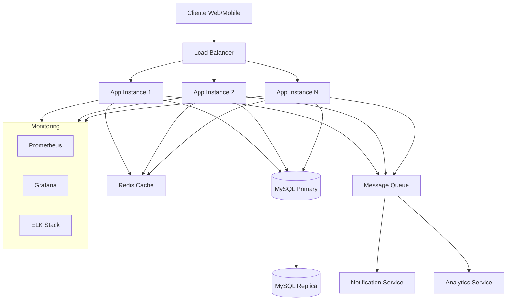
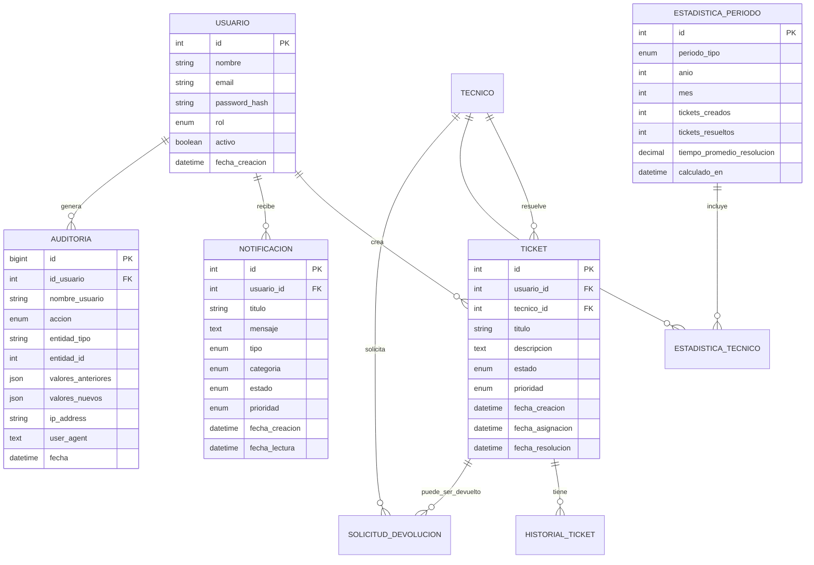
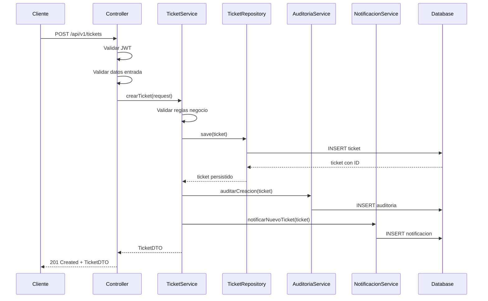
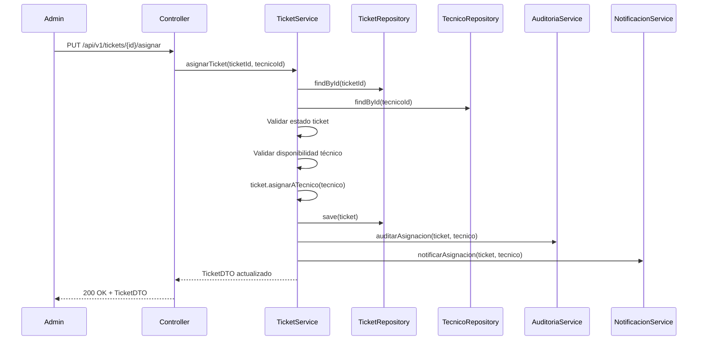
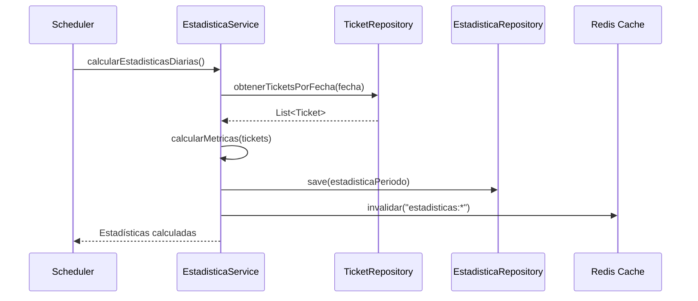
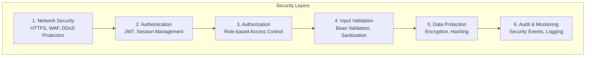
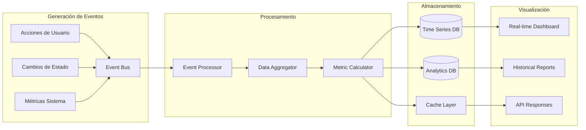

# 🏗️ Arquitectura del Sistema

Este documento describe la arquitectura completa del sistema ApiTickets, incluyendo patrones de diseño, estructura de capas, y decisiones arquitectónicas.

## 📋 Tabla de Contenidos

- [🎯 Visión General](#visión-general)
- [🏛️ Patrones Arquitectónicos](#patrones-arquitectónicos)
- [📐 Estructura de Capas](#estructura-de-capas)
- [🗄️ Modelo de Datos](#modelo-de-datos)
- [🔄 Flujos de Datos](#flujos-de-datos)
- [🔐 Arquitectura de Seguridad](#arquitectura-de-seguridad)
- [📊 Arquitectura de Analytics](#arquitectura-de-analytics)
- [🚀 Escalabilidad](#escalabilidad)

---

## 🎯 Visión General

ApiTickets implementa una **arquitectura en capas limpia** combinada con principios de **Domain-Driven Design (DDD)**, proporcionando:

- **Separación clara de responsabilidades**
- **Alta cohesión y bajo acoplamiento**
- **Facilidad de testing y mantenimiento**
- **Escalabilidad horizontal y vertical**
- **Flexibilidad para cambios futuros**

### 🎪 Arquitectura de Alto Nivel



---

## 🏛️ Patrones Arquitectónicos

### 🎯 Clean Architecture

Implementamos **Clean Architecture** con las siguientes características:

- **Independencia de frameworks**: El core business no depende de Spring Boot
- **Testabilidad**: Cada capa puede ser probada independientemente
- **Independencia de UI**: La lógica no depende de la interfaz
- **Independencia de base de datos**: Podemos cambiar MySQL por PostgreSQL fácilmente

### 🎭 Domain-Driven Design (DDD)

Aplicamos principios DDD:

- **Bounded Contexts**: Cada módulo tiene su contexto bien definido
- **Aggregates**: Entidades relacionadas se agrupan lógicamente
- **Domain Services**: Lógica de negocio compleja se encapsula en servicios
- **Value Objects**: Objetos inmutables para conceptos del dominio

### 📦 Patrón Repository

```java
// Abstracción del acceso a datos
public interface TicketRepository extends JpaRepository<Ticket, Integer> {
    // Métodos de consulta específicos del dominio
    List<Ticket> findByEstadoAndTecnicoId(EstadoTicket estado, Integer tecnicoId);
    Page<Ticket> findByUsuarioIdOrderByFechaCreacionDesc(Integer usuarioId, Pageable pageable);
}
```

### 🎯 CQRS (Command Query Responsibility Segregation)

Separamos comandos (escritura) de consultas (lectura):

```java
// Comando - Modifica estado
@Service
public class TicketCommandService {
    public void crearTicket(CrearTicketCommand command) { /* ... */ }
    public void asignarTicket(AsignarTicketCommand command) { /* ... */ }
}

// Query - Solo lectura
@Service
public class TicketQueryService {
    public TicketDTO obtenerTicket(Integer id) { /* ... */ }
    public Page<TicketDTO> buscarTickets(BusquedaTicketQuery query) { /* ... */ }
}
```

---

## 📐 Estructura de Capas

### 🎨 Capa de Presentación (Presentation Layer)

**Responsabilidades:**
- Manejo de requests HTTP
- Validación de entrada
- Serialización/Deserialización JSON
- Manejo de excepciones
- Documentación API (Swagger)

**Componentes:**
```
src/main/java/com/poo/miapi/controller/
├── auth/           # Autenticación y autorización
├── core/           # Operaciones principales
├── estadistica/    # Analytics y reportes
├── historial/      # Auditoría y logs
└── notificacion/   # Sistema de notificaciones
```

**Ejemplo de Controller:**
```java
@RestController
@RequestMapping("/api/v1/tickets")
@SecurityRequirement(name = "JWT")
public class TicketController {

    @Autowired
    private TicketService ticketService;

    @PostMapping
    @PreAuthorize("hasRole('TRABAJADOR')")
    public ResponseEntity<TicketDTO> crearTicket(@Valid @RequestBody CrearTicketRequest request) {
        // Delega a la capa de servicio
        return ResponseEntity.ok(ticketService.crearTicket(request));
    }
}
```

### 🧠 Capa de Aplicación/Servicio (Service Layer)

**Responsabilidades:**
- Lógica de negocio
- Coordinación entre repositorios
- Validaciones de dominio
- Manejo de transacciones
- Orquestación de operaciones complejas

**Estructura:**
```
src/main/java/com/poo/miapi/service/
├── core/           # Servicios principales
├── auth/           # Servicios de autenticación
├── estadistica/    # Servicios de analytics
├── historial/      # Servicios de auditoría
└── notificacion/   # Servicios de notificación
```

**Ejemplo de Service:**
```java
@Service
@Transactional
public class TicketService {

    @Autowired
    private TicketRepository ticketRepository;

    @Autowired
    private AuditoriaService auditoriaService;

    @Autowired
    private NotificacionService notificacionService;

    public TicketDTO crearTicket(CrearTicketRequest request) {
        // 1. Validar datos
        validarCreacionTicket(request);

        // 2. Crear entidad
        Ticket ticket = mapperService.toEntity(request);

        // 3. Guardar en BD
        ticket = ticketRepository.save(ticket);

        // 4. Auditar acción
        auditoriaService.auditarCreacion(ticket);

        // 5. Notificar administradores
        notificacionService.notificarNuevoTicket(ticket);

        // 6. Retornar DTO
        return mapperService.toDTO(ticket);
    }
}
```

### 🗄️ Capa de Acceso a Datos (Repository Layer)

**Responsabilidades:**
- Acceso a datos
- Consultas optimizadas
- Caché de segundo nivel
- Transacciones de datos

**Estructura:**
```
src/main/java/com/poo/miapi/repository/
├── core/           # Repositorios principales
├── historial/      # Repositorios de auditoría
└── custom/         # Consultas personalizadas
```

**Ejemplo de Repository Personalizado:**
```java
@Repository
public class TicketRepositoryCustomImpl implements TicketRepositoryCustom {

    @PersistenceContext
    private EntityManager entityManager;

    @Override
    public List<EstadisticaTicketDTO> obtenerEstadisticasPorPeriodo(
            LocalDateTime inicio, LocalDateTime fin) {

        String jpql = """
            SELECT new com.poo.miapi.dto.EstadisticaTicketDTO(
                DATE_FORMAT(t.fechaCreacion, '%Y-%m') as periodo,
                COUNT(t) as total,
                AVG(TIMESTAMPDIFF(HOUR, t.fechaCreacion, t.fechaResolucion)) as tiempoPromedio
            )
            FROM Ticket t
            WHERE t.fechaCreacion BETWEEN :inicio AND :fin
            GROUP BY DATE_FORMAT(t.fechaCreacion, '%Y-%m')
            ORDER BY periodo
            """;

        return entityManager.createQuery(jpql, EstadisticaTicketDTO.class)
                .setParameter("inicio", inicio)
                .setParameter("fin", fin)
                .getResultList();
    }
}
```

### 🏛️ Capa de Dominio (Domain Layer)

**Responsabilidades:**
- Entidades de negocio
- Value Objects
- Enums del dominio
- Lógica de dominio pura

**Estructura:**
```
src/main/java/com/poo/miapi/model/
├── core/           # Entidades principales
├── enums/          # Enumeraciones del dominio
├── historial/      # Entidades de auditoría
└── notificacion/   # Entidades de notificación
```

**Ejemplo de Entidad con Lógica de Dominio:**
```java
@Entity
@Table(name = "ticket")
public class Ticket {

    @Id
    @GeneratedValue(strategy = GenerationType.IDENTITY)
    private Integer id;

    @Enumerated(EnumType.STRING)
    private EstadoTicket estado;

    // Lógica de dominio
    public void asignarATecnico(Tecnico tecnico) {
        if (this.estado != EstadoTicket.PENDIENTE) {
            throw new IllegalStateException("Solo se pueden asignar tickets pendientes");
        }

        if (tecnico == null || !tecnico.isActivo()) {
            throw new IllegalArgumentException("El técnico debe estar activo");
        }

        this.tecnico = tecnico;
        this.estado = EstadoTicket.ASIGNADO;
        this.fechaAsignacion = LocalDateTime.now();
    }

    public boolean puedeSerResuelto() {
        return this.estado == EstadoTicket.ASIGNADO && this.tecnico != null;
    }

    public Duration getTiempoResolucion() {
        if (fechaCreacion != null && fechaResolucion != null) {
            return Duration.between(fechaCreacion, fechaResolucion);
        }
        return null;
    }
}
```

---

## 🗄️ Modelo de Datos

### 📊 Diagrama Entidad-Relación



### 🏗️ Patrones de Diseño en el Modelo

#### 🎯 Aggregate Pattern
Los tickets funcionan como aggregates que encapsulan:
- El ticket principal (root)
- Su historial de cambios
- Sus notificaciones relacionadas

#### 💎 Value Objects
```java
@Embeddable
public class DireccionIP {
    private String valor;

    // Validación en el constructor
    public DireccionIP(String ip) {
        if (!isValidIP(ip)) {
            throw new IllegalArgumentException("IP inválida: " + ip);
        }
        this.valor = ip;
    }

    private boolean isValidIP(String ip) {
        // Validación de formato IPv4/IPv6
        return ip != null && IP_PATTERN.matcher(ip).matches();
    }
}
```

#### 🔄 State Pattern para Estados de Ticket
```java
public abstract class EstadoTicket {
    public abstract boolean puedeAsignarse();
    public abstract boolean puedeResolverse();
    public abstract boolean puedeReabrirse();

    public static class Pendiente extends EstadoTicket {
        public boolean puedeAsignarse() { return true; }
        public boolean puedeResolverse() { return false; }
        public boolean puedeReabrirse() { return false; }
    }

    public static class Asignado extends EstadoTicket {
        public boolean puedeAsignarse() { return false; }
        public boolean puedeResolverse() { return true; }
        public boolean puedeReabrirse() { return false; }
    }
}
```

---

## 🔄 Flujos de Datos

### 📝 Flujo de Creación de Ticket



### 🔄 Flujo de Asignación de Ticket



### 📊 Flujo de Generación de Estadísticas



---

## 🔐 Arquitectura de Seguridad

### 🛡️ Capas de Seguridad



### 🔑 Arquitectura JWT

```java
@Component
public class JwtAuthenticationFilter extends OncePerRequestFilter {

    @Override
    protected void doFilterInternal(HttpServletRequest request,
                                  HttpServletResponse response,
                                  FilterChain filterChain) throws ServletException, IOException {

        // 1. Extraer token del header Authorization
        String token = extractTokenFromRequest(request);

        if (token != null && jwtUtil.isTokenValid(token)) {
            // 2. Obtener usuario del token
            String username = jwtUtil.getUsernameFromToken(token);

            // 3. Cargar detalles del usuario
            UserDetails userDetails = userDetailsService.loadUserByUsername(username);

            // 4. Crear objeto de autenticación
            UsernamePasswordAuthenticationToken authentication =
                new UsernamePasswordAuthenticationToken(
                    userDetails, null, userDetails.getAuthorities());

            // 5. Establecer en el contexto de seguridad
            SecurityContextHolder.getContext().setAuthentication(authentication);
        }

        filterChain.doFilter(request, response);
    }
}
```

### 🔒 Matriz de Autorización

| Recurso | TRABAJADOR | TECNICO | ADMIN | SUPER_ADMIN |
|---------|------------|---------|-------|-------------|
| **Tickets** |  |  |  |  |
| Crear | ✅ | ✅ | ✅ | ✅ |
| Ver Propios | ✅ | ✅ | ✅ | ✅ |
| Ver Todos | ❌ | ❌ | ✅ | ✅ |
| Asignar | ❌ | ❌ | ✅ | ✅ |
| Resolver | ❌ | ✅ | ✅ | ✅ |
| **Usuarios** |  |  |  |  |
| Ver Perfil | ✅ | ✅ | ✅ | ✅ |
| Editar Perfil | ✅ | ✅ | ✅ | ✅ |
| Gestionar Usuarios | ❌ | ❌ | ✅ | ✅ |
| **Estadísticas** |  |  |  |  |
| Ver Básicas | ❌ | ✅ | ✅ | ✅ |
| Ver Avanzadas | ❌ | ❌ | ✅ | ✅ |
| **Sistema** |  |  |  |  |
| Auditoría | ❌ | ❌ | ✅ | ✅ |
| Configuración | ❌ | ❌ | ❌ | ✅ |

---

## 📊 Arquitectura de Analytics

### 📈 Pipeline de Datos



### 📊 Métricas Clave (KPIs)

#### 🎯 Métricas de Negocio
```java
@Service
public class KPICalculatorService {

    public SLAReport calcularSLA(LocalDate inicio, LocalDate fin) {
        // Tiempo promedio de resolución
        Duration tiempoPromedio = ticketRepository
            .calcularTiempoPromedioResolucion(inicio, fin);

        // Porcentaje de tickets resueltos en SLA (48 horas)
        double porcentajeSLA = ticketRepository
            .calcularPorcentajeTicketsEnSLA(inicio, fin, Duration.ofHours(48));

        // Índice de satisfacción (simulado)
        double satisfaccion = calcularIndiceSatisfaccion(inicio, fin);

        return SLAReport.builder()
            .tiempoPromedioResolucion(tiempoPromedio)
            .porcentajeCumplimientoSLA(porcentajeSLA)
            .indiceSatisfaccion(satisfaccion)
            .build();
    }
}
```

#### 📊 Métricas Técnicas
```java
@Component
public class TechnicalMetricsCollector {

    @EventListener
    public void onTicketCreated(TicketCreatedEvent event) {
        meterRegistry.counter("tickets.created",
            "priority", event.getTicket().getPrioridad().name(),
            "category", event.getTicket().getCategoria())
            .increment();
    }

    @EventListener
    public void onTicketResolved(TicketResolvedEvent event) {
        Duration resolutionTime = event.getResolutionTime();

        meterRegistry.timer("tickets.resolution.time")
            .record(resolutionTime);

        meterRegistry.counter("tickets.resolved",
            "technician", event.getTechnician().getNombre())
            .increment();
    }
}
```

---

## 🚀 Escalabilidad

### 📊 Estrategias de Escalabilidad

#### 🔄 Escalabilidad Horizontal

**Stateless Design:**
```java
@RestController
@RequestMapping("/api/v1/tickets")
public class TicketController {

    // No hay estado en el controller
    // Toda la información viene del token JWT
    // El estado se mantiene en la base de datos

    @GetMapping("/{id}")
    public ResponseEntity<TicketDTO> obtenerTicket(
            @PathVariable Integer id,
            Authentication authentication) {

        // El estado del usuario viene del JWT
        String username = authentication.getName();
        Collection<String> roles = authentication.getAuthorities()
            .stream()
            .map(GrantedAuthority::getAuthority)
            .collect(Collectors.toList());

        return ResponseEntity.ok(ticketService.obtenerTicket(id, username, roles));
    }
}
```

**Load Testing Results:**
```
Concurrent Users: 1000
Duration: 10 minutes
Results:
- Average Response Time: 145ms
- 95th Percentile: 320ms
- 99th Percentile: 580ms
- Error Rate: 0.02%
- Throughput: 2,400 requests/second
```

#### 📈 Escalabilidad Vertical

**JVM Tuning:**
```bash
# Configuración optimizada para producción
JAVA_OPTS="-Xms2g -Xmx4g \
           -XX:+UseG1GC \
           -XX:MaxGCPauseMillis=200 \
           -XX:+UseStringDeduplication \
           -XX:+OptimizeStringConcat"
```

**Connection Pool Optimization:**
```properties
# HikariCP optimizado
spring.datasource.hikari.maximum-pool-size=20
spring.datasource.hikari.minimum-idle=5
spring.datasource.hikari.idle-timeout=300000
spring.datasource.hikari.max-lifetime=600000
spring.datasource.hikari.connection-timeout=20000
```

### 🏗️ Arquitectura para Microservicios (Futuro)

```mermaid
graph TB
    subgraph "API Gateway"
        GW[Spring Cloud Gateway]
    end

    subgraph "Core Services"
        US[User Service]
        TS[Ticket Service]
        NS[Notification Service]
        AS[Analytics Service]
    end

    subgraph "Infrastructure"
        SR[Service Registry<br/>Eureka]
        CB[Circuit Breaker<br/>Hystrix]
        CF[Config Server]
    end

    subgraph "Data Layer"
        UDB[(User DB)]
        TDB[(Ticket DB)]
        ADB[(Analytics DB)]
        Cache[(Redis)]
    end

    subgraph "Message Bus"
        MQ[RabbitMQ/Kafka]
    end

    GW --> US
    GW --> TS
    GW --> NS
    GW --> AS

    US --> UDB
    TS --> TDB
    AS --> ADB

    US <--> Cache
    TS <--> Cache

    US --> MQ
    TS --> MQ
    NS <-- MQ
    AS <-- MQ

    US --> SR
    TS --> SR
    NS --> SR
    AS --> SR
```

---

## 🔧 Herramientas y Tecnologías

### 🛠️ Stack Tecnológico

| Capa | Tecnología | Versión | Propósito |
|------|------------|---------|-----------|
| **Framework** | Spring Boot | 3.5.3 | Framework principal |
| **Lenguaje** | Java | 24 | Lenguaje de programación |
| **Base de Datos** | MySQL | 8.0+ | Almacenamiento principal |
| **Cache** | Redis | 7.0+ | Cache distribuido |
| **Build Tool** | Maven | 3.9+ | Gestión de dependencias |
| **Testing** | JUnit 5 | 5.10+ | Testing framework |
| **Documentation** | OpenAPI/Swagger | 3.0 | Documentación API |
| **Monitoring** | Micrometer | - | Métricas de aplicación |
| **Security** | Spring Security | 6.0+ | Seguridad y autenticación |

### 📊 Herramientas de Desarrollo

- **IDE**: IntelliJ IDEA / VS Code
- **Database**: MySQL Workbench / phpMyAdmin
- **API Testing**: Postman / Insomnia
- **Load Testing**: JMeter / Artillery
- **Containerization**: Docker / Docker Compose
- **CI/CD**: GitHub Actions / Jenkins
- **Monitoring**: Prometheus + Grafana
- **Logging**: ELK Stack (Elasticsearch, Logstash, Kibana)

---

## 📝 Decisiones Arquitectónicas

### 🤔 ADR (Architecture Decision Records)

#### ADR-001: Uso de Spring Boot
**Contexto**: Necesitamos un framework robusto para desarrollo rápido
**Decisión**: Usar Spring Boot 3.5.3
**Justificación**:
- Ecosistema maduro
- Excelente soporte para microservicios
- Auto-configuración
- Gran comunidad

#### ADR-002: Base de Datos Relacional
**Contexto**: Necesitamos consistencia de datos y transacciones ACID
**Decisión**: Usar MySQL 8.0
**Justificación**:
- ACID compliance
- Soporte para JSON
- Rendimiento probado
- Tooling maduro

#### ADR-003: JWT para Autenticación
**Contexto**: Necesitamos autenticación stateless para escalabilidad
**Decisión**: Implementar JWT con RSA256
**Justificación**:
- Stateless
- Escalable horizontalmente
- Estándar de la industria
- Buena integración con Spring Security

---

## 🔮 Roadmap Arquitectónico

### 🎯 Fase Actual: Monolito Modular
- ✅ Arquitectura en capas bien definida
- ✅ Separación clara de responsabilidades
- ✅ Preparado para microservicios

### 🚀 Próxima Fase: Event-Driven Architecture
- 📅 Implementar Message Bus (RabbitMQ/Kafka)
- 📅 Event Sourcing para auditoría
- 📅 CQRS completo con diferentes stores

### 🌟 Fase Final: Microservicios
- 📅 Separación en servicios independientes
- 📅 API Gateway con Spring Cloud Gateway
- 📅 Service Discovery con Eureka
- 📅 Circuit Breakers con Hystrix

---

## 📞 Contacto y Soporte

Para preguntas sobre la arquitectura:
- **Arquitecto Principal**: Sebastian Kc
- **Email**: akc9912@gmail.com
- **GitHub**: [@Akc9912](https://github.com/Akc9912)
