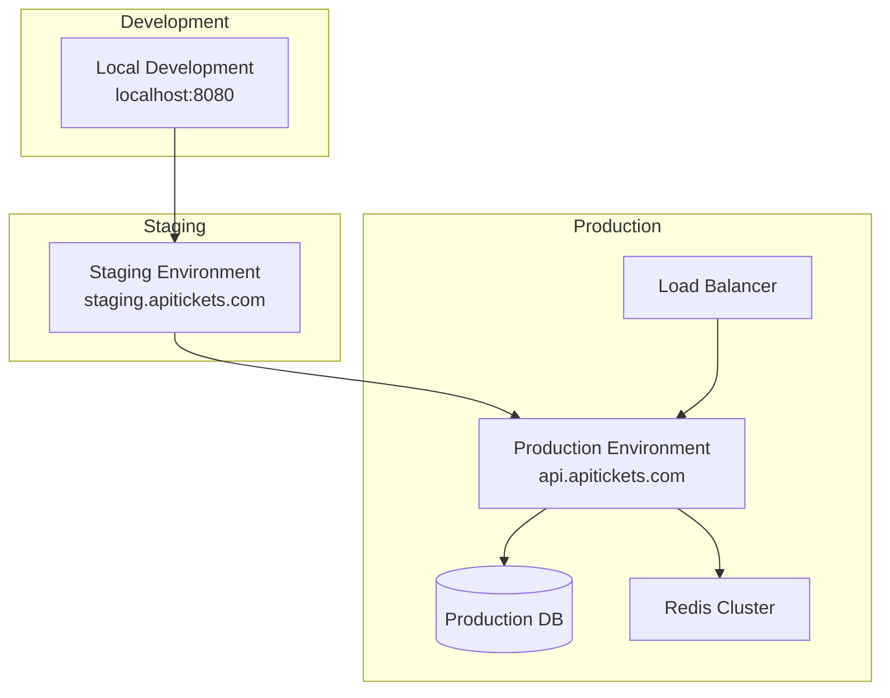

# 🚢 Guía de Despliegue - ApiTickets

Documentación completa para el despliegue de ApiTickets en diferentes ambientes.

## 📋 Tabla de Contenidos

- [🎯 Ambientes de Despliegue](#ambientes-de-despliegue)
- [📋 Prerrequisitos](#prerrequisitos)
- [🚀 Despliegue Local](#despliegue-local)
- [🐳 Despliegue con Docker](#despliegue-con-docker)
- [☁️ Despliegue en la Nube](#despliegue-en-la-nube)
- [⚙️ Configuración por Ambiente](#configuración-por-ambiente)
- [📊 Monitoreo y Observabilidad](#monitoreo-y-observabilidad)
- [🔧 Troubleshooting](#troubleshooting)

---

## 🎯 Ambientes de Despliegue

### 🏗️ Arquitectura de Ambientes



### 📊 Especificaciones por Ambiente

| Ambiente | CPU | RAM | Storage | Database | Cache | Monitoring |
|----------|-----|-----|---------|----------|-------|------------|
| **Local** | 2 cores | 4GB | 20GB | MySQL 8.0 | - | Basic |
| **Staging** | 4 cores | 8GB | 50GB | MySQL 8.0 | Redis | Full |
| **Production** | 8 cores | 16GB | 200GB | MySQL 8.0 HA | Redis Cluster | Enterprise |

---

## 📋 Prerrequisitos

### 🛠️ Software Requerido

#### **Para Desarrollo Local:**
- ☑️ **Java 24+** ([OpenJDK](https://jdk.java.net/24/) recomendado)
- ☑️ **Maven 3.9+**
- ☑️ **MySQL 8.0+**
- ☑️ **Git**
- ☑️ **Docker** (opcional)

#### **Para Producción:**
- ☑️ **Java 24 JRE**
- ☑️ **MySQL 8.0+ con HA**
- ☑️ **Redis 7.0+**
- ☑️ **Nginx** (Load Balancer)
- ☑️ **SSL Certificates**
- ☑️ **Monitoring Stack** (Prometheus, Grafana)

### 🔐 Configuración de Seguridad

#### **Credenciales Requeridas:**
```bash
# Base de datos
DB_URL=jdbc:mysql://localhost:3306/apiticket
DB_USERNAME=apiticket_user
DB_PASSWORD=secure_password_here

# JWT
JWT_SECRET=your-256-bit-secret-key-here
JWT_EXPIRATION=86400000

# Redis (Producción)
REDIS_HOST=redis.cluster.internal
REDIS_PASSWORD=redis_password_here

# SMTP (Notificaciones por email)
SMTP_HOST=smtp.gmail.com
SMTP_USERNAME=notifications@apitickets.com
SMTP_PASSWORD=app_specific_password
```

---

## 🚀 Despliegue Local

### ⚡ Setup Rápido

```bash
# 1. Clonar repositorio
git clone https://github.com/Akc9912/apiTickets.git
cd apiTickets

# 2. Instalar MySQL y crear base de datos
mysql -u root -p -e "CREATE DATABASE apiticket;"
mysql -u root -p apiticket < create_database.sql
mysql -u root -p apiticket < migracion_completa.sql

# 3. Configurar variables de entorno
cp src/main/resources/application-local.properties.example \
   src/main/resources/application-local.properties

# Editar application-local.properties con tus configuraciones

# 4. Compilar y ejecutar
./mvnw clean install
./mvnw spring-boot:run -Dspring-boot.run.profiles=local
```

### 🔧 Configuración Local

**application-local.properties:**
```properties
# Database
spring.datasource.url=jdbc:mysql://localhost:3306/apiticket
spring.datasource.username=root
spring.datasource.password=your_password

# JPA
spring.jpa.hibernate.ddl-auto=validate
spring.jpa.show-sql=true
logging.level.org.hibernate.SQL=DEBUG

# JWT
jwt.secret=local-development-secret-key
jwt.expiration=86400000

# Logging
logging.level.com.poo.miapi=DEBUG
logging.file.name=logs/application-local.log

# Actuator
management.endpoints.web.exposure.include=*
management.endpoint.health.show-details=always
```

### 🧪 Verificación del Despliegue Local

```bash
# Health check
curl http://localhost:8080/actuator/health

# Test endpoint
curl http://localhost:8080/api/v1/auth/health

# Swagger UI
open http://localhost:8080/swagger-ui/index.html
```

---

## 🐳 Despliegue con Docker

### 📦 Docker Compose (Recomendado)

**docker-compose.yml:**
```yaml
version: '3.8'

services:
  # Base de datos MySQL
  mysql:
    image: mysql:8.0
    container_name: apitickets-mysql
    environment:
      MYSQL_ROOT_PASSWORD: root123
      MYSQL_DATABASE: apiticket
      MYSQL_USER: apiticket
      MYSQL_PASSWORD: apiticket123
    volumes:
      - mysql_data:/var/lib/mysql
      - ./create_database.sql:/docker-entrypoint-initdb.d/01-create_database.sql
      - ./migracion_completa.sql:/docker-entrypoint-initdb.d/02-migracion_completa.sql
    ports:
      - "3306:3306"
    networks:
      - apitickets-network

  # Redis (para staging/production)
  redis:
    image: redis:7-alpine
    container_name: apitickets-redis
    command: redis-server --requirepass redis123
    ports:
      - "6379:6379"
    volumes:
      - redis_data:/data
    networks:
      - apitickets-network

  # Aplicación principal
  app:
    build: .
    container_name: apitickets-app
    depends_on:
      - mysql
      - redis
    environment:
      SPRING_PROFILES_ACTIVE: docker
      DB_URL: jdbc:mysql://mysql:3306/apiticket
      DB_USERNAME: apiticket
      DB_PASSWORD: apiticket123
      REDIS_HOST: redis
      REDIS_PASSWORD: redis123
      JWT_SECRET: docker-secret-key-change-in-production
    ports:
      - "8080:8080"
    volumes:
      - app_logs:/app/logs
    networks:
      - apitickets-network
    healthcheck:
      test: ["CMD", "curl", "-f", "http://localhost:8080/actuator/health"]
      interval: 30s
      timeout: 10s
      retries: 3

volumes:
  mysql_data:
  redis_data:
  app_logs:

networks:
  apitickets-network:
    driver: bridge
```

### 🚀 Comandos Docker

```bash
# Construir y ejecutar todo
docker-compose up -d

# Ver logs
docker-compose logs -f app

# Ejecutar solo la base de datos
docker-compose up -d mysql

# Rebuild aplicación
docker-compose build app
docker-compose up -d app

# Limpiar todo
docker-compose down -v
```

### 📋 Dockerfile Optimizado

```dockerfile
# Etapa 1: Build
FROM maven:3.9-openjdk-24-slim AS build
WORKDIR /app
COPY pom.xml .
COPY src ./src
RUN mvn clean package -DskipTests

# Etapa 2: Runtime
FROM openjdk:24-jdk-slim
WORKDIR /app

# Crear usuario no-root
RUN groupadd -r apitickets && useradd -r -g apitickets apitickets

# Instalar dependencias del sistema
RUN apt-get update && apt-get install -y \
    curl \
    && rm -rf /var/lib/apt/lists/*

# Copiar JAR desde etapa de build
COPY --from=build /app/target/miapi-*.jar app.jar

# Crear directorio de logs
RUN mkdir -p /app/logs && chown -R apitickets:apitickets /app

# Cambiar a usuario no-root
USER apitickets

# Configuración JVM optimizada
ENV JAVA_OPTS="-Xms512m -Xmx2g -XX:+UseG1GC -XX:MaxGCPauseMillis=200"

# Health check
HEALTHCHECK --interval=30s --timeout=10s --start-period=60s --retries=3 \
  CMD curl -f http://localhost:8080/actuator/health || exit 1

# Exponer puerto
EXPOSE 8080

# Comando de ejecución
ENTRYPOINT ["sh", "-c", "java $JAVA_OPTS -jar app.jar"]
```

---

## ☁️ Despliegue en la Nube

### 🌐 AWS ECS (Elastic Container Service)

#### **1. Configuración de ECS:**

**task-definition.json:**
```json
{
  "family": "apitickets-task",
  "networkMode": "awsvpc",
  "requiresCompatibilities": ["FARGATE"],
  "cpu": "1024",
  "memory": "2048",
  "executionRoleArn": "arn:aws:iam::ACCOUNT:role/ecsTaskExecutionRole",
  "taskRoleArn": "arn:aws:iam::ACCOUNT:role/ecsTaskRole",
  "containerDefinitions": [
    {
      "name": "apitickets-app",
      "image": "your-registry/apitickets:latest",
      "portMappings": [
        {
          "containerPort": 8080,
          "protocol": "tcp"
        }
      ],
      "environment": [
        {
          "name": "SPRING_PROFILES_ACTIVE",
          "value": "production"
        }
      ],
      "secrets": [
        {
          "name": "DB_PASSWORD",
          "valueFrom": "arn:aws:secretsmanager:region:account:secret:db-password"
        },
        {
          "name": "JWT_SECRET",
          "valueFrom": "arn:aws:secretsmanager:region:account:secret:jwt-secret"
        }
      ],
      "logConfiguration": {
        "logDriver": "awslogs",
        "options": {
          "awslogs-group": "/ecs/apitickets",
          "awslogs-region": "us-east-1",
          "awslogs-stream-prefix": "ecs"
        }
      },
      "healthCheck": {
        "command": [
          "CMD-SHELL",
          "curl -f http://localhost:8080/actuator/health || exit 1"
        ],
        "interval": 30,
        "timeout": 5,
        "retries": 3
      }
    }
  ]
}
```

#### **2. Scripts de Despliegue:**

```bash
#!/bin/bash
# deploy-aws.sh

# Configurar variables
CLUSTER_NAME="apitickets-cluster"
SERVICE_NAME="apitickets-service"
TASK_DEFINITION="apitickets-task"
IMAGE_URI="your-registry/apitickets:latest"

# Build y push de imagen
docker build -t apitickets:latest .
docker tag apitickets:latest $IMAGE_URI
docker push $IMAGE_URI

# Actualizar task definition
aws ecs register-task-definition --cli-input-json file://task-definition.json

# Actualizar servicio
aws ecs update-service \
  --cluster $CLUSTER_NAME \
  --service $SERVICE_NAME \
  --task-definition $TASK_DEFINITION

# Esperar deployment
aws ecs wait services-stable \
  --cluster $CLUSTER_NAME \
  --services $SERVICE_NAME

echo "Deployment completed successfully!"
```

### 🔵 Azure Container Instances

**azure-deployment.yml:**
```yaml
apiVersion: 2019-12-01
location: eastus
name: apitickets-container-group
properties:
  containers:
  - name: apitickets-app
    properties:
      image: your-registry/apitickets:latest
      resources:
        requests:
          cpu: 2
          memoryInGb: 4
      ports:
      - port: 8080
        protocol: TCP
      environmentVariables:
      - name: SPRING_PROFILES_ACTIVE
        value: production
      - name: DB_URL
        secureValue: jdbc:mysql://your-mysql-server:3306/apiticket
  - name: nginx-proxy
    properties:
      image: nginx:alpine
      resources:
        requests:
          cpu: 0.5
          memoryInGb: 0.5
      ports:
      - port: 80
        protocol: TCP
  ipAddress:
    type: Public
    ports:
    - protocol: TCP
      port: 80
    dnsNameLabel: apitickets-prod
  osType: Linux
tags: {}
type: Microsoft.ContainerInstance/containerGroups
```

---

## ⚙️ Configuración por Ambiente

### 🏗️ application-staging.properties

```properties
# Database - Staging
spring.datasource.url=jdbc:mysql://staging-db.internal:3306/apiticket
spring.datasource.username=${DB_USERNAME}
spring.datasource.password=${DB_PASSWORD}
spring.datasource.hikari.maximum-pool-size=10

# Redis
spring.redis.host=${REDIS_HOST:staging-redis.internal}
spring.redis.password=${REDIS_PASSWORD}
spring.redis.port=6379

# JWT
jwt.secret=${JWT_SECRET}
jwt.expiration=86400000

# Logging
logging.level.com.poo.miapi=INFO
logging.file.name=/app/logs/application.log
logging.pattern.file=%d{ISO8601} [%thread] %-5level %logger{36} - %msg%n

# Actuator
management.endpoints.web.exposure.include=health,metrics,info,prometheus
management.endpoint.health.show-details=when_authorized

# CORS - Staging URLs
cors.allowed-origins=https://staging.apitickets.com,https://staging-admin.apitickets.com

# Email notifications
spring.mail.host=${SMTP_HOST}
spring.mail.username=${SMTP_USERNAME}
spring.mail.password=${SMTP_PASSWORD}
```

### 🚀 application-production.properties

```properties
# Database - Production with HA
spring.datasource.url=jdbc:mysql://prod-db-cluster.internal:3306/apiticket
spring.datasource.username=${DB_USERNAME}
spring.datasource.password=${DB_PASSWORD}
spring.datasource.hikari.maximum-pool-size=20
spring.datasource.hikari.minimum-idle=5

# Redis Cluster
spring.redis.cluster.nodes=${REDIS_CLUSTER_NODES}
spring.redis.password=${REDIS_PASSWORD}
spring.redis.timeout=2000ms

# JWT
jwt.secret=${JWT_SECRET}
jwt.expiration=3600000

# Logging - Production
logging.level.com.poo.miapi=WARN
logging.level.org.springframework.security=WARN
logging.file.name=/app/logs/application.log
logging.pattern.file=%d{ISO8601} [%thread] %-5level %logger{36} - %msg%n

# Actuator - Limited exposure
management.endpoints.web.exposure.include=health,metrics,prometheus
management.endpoint.health.show-details=never
management.security.enabled=true

# CORS - Production URLs
cors.allowed-origins=https://app.apitickets.com,https://admin.apitickets.com

# SSL/TLS
server.ssl.enabled=true
server.ssl.key-store=/app/ssl/keystore.p12
server.ssl.key-store-password=${SSL_KEYSTORE_PASSWORD}
server.ssl.key-store-type=PKCS12

# Performance optimizations
spring.jpa.hibernate.ddl-auto=none
spring.jpa.open-in-view=false
spring.jpa.properties.hibernate.jdbc.batch_size=25
```

---

## 📊 Monitoreo y Observabilidad

### 📈 Prometheus Configuration

**prometheus.yml:**
```yaml
global:
  scrape_interval: 15s

scrape_configs:
  - job_name: 'apitickets'
    static_configs:
      - targets: ['apitickets-app:8080']
    metrics_path: '/actuator/prometheus'
    scrape_interval: 30s

  - job_name: 'mysql'
    static_configs:
      - targets: ['mysql-exporter:9104']

  - job_name: 'redis'
    static_configs:
      - targets: ['redis-exporter:9121']
```

### 📊 Grafana Dashboard

**docker-compose.monitoring.yml:**
```yaml
version: '3.8'

services:
  prometheus:
    image: prom/prometheus:latest
    ports:
      - "9090:9090"
    volumes:
      - ./monitoring/prometheus.yml:/etc/prometheus/prometheus.yml
    networks:
      - monitoring

  grafana:
    image: grafana/grafana:latest
    ports:
      - "3000:3000"
    environment:
      - GF_SECURITY_ADMIN_PASSWORD=admin123
    volumes:
      - grafana_data:/var/lib/grafana
      - ./monitoring/dashboards:/etc/grafana/provisioning/dashboards
    networks:
      - monitoring

  # Exportadores
  mysql-exporter:
    image: prom/mysqld-exporter
    environment:
      - DATA_SOURCE_NAME=${DB_USERNAME}:${DB_PASSWORD}@(mysql:3306)/
    networks:
      - monitoring
      - apitickets-network

volumes:
  grafana_data:

networks:
  monitoring:
  apitickets-network:
    external: true
```

### 🚨 Alerting Rules

**alerts.yml:**
```yaml
groups:
  - name: apitickets.rules
    rules:
      - alert: HighErrorRate
        expr: rate(http_requests_total{status=~"5.."}[5m]) > 0.1
        for: 2m
        labels:
          severity: critical
        annotations:
          summary: "High error rate detected"
          description: "Error rate is {{ $value }} errors per second"

      - alert: DatabaseConnectionHigh
        expr: hikaricp_connections_active / hikaricp_connections_max > 0.8
        for: 5m
        labels:
          severity: warning
        annotations:
          summary: "Database connection pool utilization high"

      - alert: HighResponseTime
        expr: http_request_duration_seconds{quantile="0.95"} > 1
        for: 3m
        labels:
          severity: warning
        annotations:
          summary: "High response time detected"
```

---

## 🔧 Troubleshooting

### 🐛 Problemas Comunes

#### **Error: "Connection refused" to database**
```bash
# Verificar conectividad
telnet mysql_host 3306

# Verificar logs de MySQL
docker logs apitickets-mysql

# Verificar configuración
echo $DB_URL
```

**Solución:**
```bash
# Verificar que MySQL esté corriendo
docker-compose ps mysql

# Reiniciar contenedor MySQL
docker-compose restart mysql

# Verificar logs de aplicación
docker-compose logs app
```

#### **Error: "JWT token expired"**
```bash
# Verificar configuración JWT
echo $JWT_SECRET
echo $JWT_EXPIRATION
```

**Solución:**
```bash
# Renovar token usando refresh endpoint
curl -X POST http://localhost:8080/api/v1/auth/refresh \
  -H "Content-Type: application/json" \
  -d '{"refreshToken": "your_refresh_token"}'
```

#### **Error: "Out of Memory"**
```bash
# Verificar uso de memoria
docker stats apitickets-app

# Verificar logs JVM
docker logs apitickets-app | grep -i "OutOfMemoryError"
```

**Solución:**
```bash
# Aumentar memoria en docker-compose.yml
environment:
  - JAVA_OPTS=-Xms1g -Xmx4g

# O en Dockerfile
ENV JAVA_OPTS="-Xms1g -Xmx4g -XX:+UseG1GC"
```

### 📋 Health Checks

```bash
# Health check completo
curl http://localhost:8080/actuator/health

# Health check de base de datos
curl http://localhost:8080/actuator/health/db

# Métricas Prometheus
curl http://localhost:8080/actuator/prometheus

# Info de la aplicación
curl http://localhost:8080/actuator/info
```

### 🔍 Debugging en Producción

```bash
# Logs en tiempo real
docker logs -f apitickets-app

# Logs con filtro de errores
docker logs apitickets-app 2>&1 | grep ERROR

# Entrar al contenedor para debugging
docker exec -it apitickets-app /bin/bash

# Verificar métricas JVM
curl http://localhost:8080/actuator/metrics/jvm.memory.used

# Verificar threads
curl http://localhost:8080/actuator/metrics/jvm.threads.live
```

---

## 🔄 CI/CD Pipeline

### 🚀 GitHub Actions

**.github/workflows/deploy.yml:**
```yaml
name: Deploy to Production

on:
  push:
    branches: [main]

jobs:
  test:
    runs-on: ubuntu-latest
    steps:
      - uses: actions/checkout@v3
      - name: Set up Java
        uses: actions/setup-java@v3
        with:
          java-version: '24'
          distribution: 'temurin'
      - name: Run tests
        run: ./mvnw test

  build-and-deploy:
    needs: test
    runs-on: ubuntu-latest
    steps:
      - uses: actions/checkout@v3

      - name: Configure AWS credentials
        uses: aws-actions/configure-aws-credentials@v2
        with:
          aws-access-key-id: ${{ secrets.AWS_ACCESS_KEY_ID }}
          aws-secret-access-key: ${{ secrets.AWS_SECRET_ACCESS_KEY }}
          aws-region: us-east-1

      - name: Build and push Docker image
        run: |
          docker build -t apitickets:${{ github.sha }} .
          docker tag apitickets:${{ github.sha }} $ECR_REGISTRY/apitickets:latest
          docker push $ECR_REGISTRY/apitickets:latest

      - name: Deploy to ECS
        run: |
          aws ecs update-service \
            --cluster production-cluster \
            --service apitickets-service \
            --force-new-deployment
```

---

## 📞 Soporte y Contacto

### 🆘 Obtener Ayuda

- **Documentación**: [./README.md](../README.md)
- **Issues**: [GitHub Issues](https://github.com/Akc9912/apiTickets/issues)
- **Email**: akc9912@gmail.com

### 📧 Contacto del Equipo DevOps

- **DevOps Lead**: Sebastian Kc
- **Email**: akc9912@gmail.com
- **GitHub**: [@Akc9912](https://github.com/Akc9912)

---

*Última actualización: Octubre 2025*
