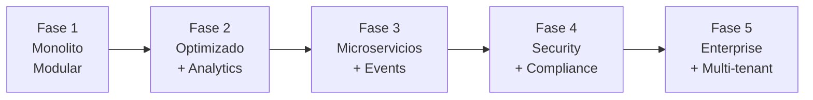

# 🚀 Fases de Desarrollo - ApiTickets

Este documento detalla el roadmap realista del proyecto ApiTickets basado en el estado actual del código y establece prioridades claras para e## 🚨 Fase 2: Calidad y Testing (CRÍTICA - ### 📊 Quality Gates Implementation

#### **Integrated Quality Pipeline** 🚨

**Paso 1: Maven Verify (Herramientas Locales)**
```xml
<!-- pom.xml plugins integration -->
mvn verify ejecuta automáticamente:
✅ Checkstyle: Estándares de codificación
✅ SpotBugs: Detección de bugs potenciales
✅ JaCoCo: Coverage reporting y enforcement
```

**Paso 2: SonarQube Analysis (Quality Gate)**
```yaml
SonarQube consume reportes de:
✅ JaCoCo coverage report (target/site/jacoco/jacoco.xml)
✅ Checkstyle results (target/checkstyle-result.xml)
✅ SpotBugs findings (target/spotbugs.xml)
✅ Unit test execution results
```

**Paso 3: CI/CD Pipeline Integration**
```yaml
Pipeline Stages:
1. Build + Compile (mvn compile)
2. Unit Tests + Quality (mvn verify)
   - Ejecuta Checkstyle + SpotBugs + JaCoCo
   - Falla si coverage < 80%
   - Falla si bugs críticos detectados
3. SonarQube Analysis
   - Consume reportes generados
   - Aplica Quality Gate rules
   - BLOQUEA pipeline si gate falla
4. Integration Tests (solo si Quality Gate pasa)
5. Security Scan (OWASP ZAP)
6. Build Docker Image
7. Deploy to Staging
```

**Configuración de Bloqueo:**
```yaml
# Jenkinsfile/GitHub Actions
- mvn verify || exit 1  # Falla si quality tools fallan
- sonar-scanner || exit 1  # Falla si SonarQube gate falla
- if: success()  # Solo continúa si pasos anteriores exitosos
```

**📋 Configuración Detallada:**
Ver archivo completo: [`quality-gates-config.md`](./quality-gates-config.md)
- pom.xml con plugins integrados
- Archivos de configuración (checkstyle.xml, spotbugs-exclude.xml)
- Examples de CI/CD (GitHub Actions, Jenkins)
- Comandos para desarrollo localIORIDAD MÁXIMA** 🔥*desarrollo futuro.

## 📋 Tabla de Contenidos

- [🎯 Estado Actual del Proyecto](#estado-actual-del-proyecto)
- [✅ Fase 1: Fundación y Funcionalidades Core (COMPLETADA)](#fase-1-fundación-y-funcionalidades-core-completada)
- [� Fase 2: Calidad y Testing (CRÍTICA - En Progreso)](#fase-2-calidad-y-testing-crítica---en-progreso)
- [⚡ Fase 3: Optimización y Performance (ALTA Prioridad)](#fase-3-optimización-y-performance-alta-prioridad)
- [🔒 Fase 4: Seguridad Avanzada (MEDIA Prioridad)](#fase-4-seguridad-avanzada-media-prioridad)
- [� Fase 5: Escalabilidad Enterprise (BAJA Prioridad)](#fase-5-escalabilidad-enterprise-baja-prioridad)
- [� Ideas de Futuras Implementaciones](#ideas-de-futuras-implementaciones)

---

## 🎯 Estado Actual del Proyecto

### 📊 Métricas Reales (Octubre 2025)
```
✅ Archivos Java: 136
✅ Líneas de Código: 16,893
✅ Controladores: 11
✅ Endpoints: 60+
✅ Entidades: 15+
✅ Enums: 11
❌ Tests: 1 archivo (5% coverage)
✅ Documentación: Extensa
```

### 🏗️ Arquitectura Implementada
```
✅ Spring Boot 3.5.3 + Java 24
✅ MySQL 8.0 con migraciones
✅ JWT Authentication (HS256)
✅ WebSocket para tiempo real
✅ Sistema de auditoría completo
✅ Sistema de notificaciones avanzado
✅ Sistema de estadísticas multi-período
✅ Docker + Docker Compose
✅ OpenAPI/Swagger documentation
```

### 🎪 Filosofía de Desarrollo Actualizada

- **Feature Complete First**: Las funcionalidades principales están implementadas
- **Quality Gates**: Testing y optimización son prioridad inmediata
- **Real-World Ready**: Enfoque en producción y monitoreo
- **Performance Critical**: Optimización para carga real
- **Security Hardening**: Fortalecer seguridad existente

---

## ✅ Fase 1: Fundación y Funcionalidades Core (COMPLETADA)

### 🎯 Objetivos Logrados
Sistema completo con todas las funcionalidades principales implementadas, incluyendo características avanzadas no planificadas originalmente.

### 🏗️ Arquitectura Implementada

#### **Stack Tecnológico**
- ✅ **Spring Boot 3.5.3**: Framework con configuración completa
- ✅ **Java 24**: Características modernas del lenguaje
- ✅ **MySQL 8.0**: Base de datos con migraciones completas
- ✅ **Maven**: Gestión de dependencias optimizada
- ✅ **Docker**: Containerización lista para producción

#### **Arquitectura Completa**
```
✅ Presentation Layer    (11 Controllers, DTOs especializados, Exception Handling)
✅ Service Layer         (Lógica de negocio compleja, Validaciones avanzadas)
✅ Repository Layer      (JPA Repositories optimizados, Consultas nativas)
✅ Domain Layer          (15+ Entidades, 11 Enums, Value Objects)
✅ Config Layer          (Security, WebSocket, Async, OpenAPI)
```

### 🔐 Sistema de Seguridad Robusto

#### **Autenticación JWT Completa**
- ✅ **JWT con JJWT 0.11.5**: Tokens seguros con HS256
- ✅ **4 Roles Implementados**: SUPERADMIN, ADMIN, TECNICO, TRABAJADOR
- ✅ **Gestión de Contraseñas**: BCrypt + cambio/reset de passwords
- ✅ **Session Stateless**: Completamente sin estado

#### **Control de Acceso Granular**
- ✅ **Endpoints por Rol**: Cada endpoint con validación específica
- ✅ **Validación de Permisos**: Lógica compleja de autorización
- ✅ **Auditoría Automática**: Logging de todas las acciones de seguridad
- ✅ **Protección CORS**: Configuración restrictiva

### 🗄️ Modelo de Datos Avanzado

#### **Entidades Core (15+)**
- ✅ **Usuario + especializaciones**: Admin, SuperAdmin, Tecnico, Trabajador
- ✅ **Sistema de Tickets**: Estados, prioridades, asignaciones
- ✅ **Sistema de Auditoría**: Registro completo de acciones
- ✅ **Sistema de Notificaciones**: 13 tipos, prioridades, metadata
- ✅ **Sistema de Estadísticas**: Multi-período, KPIs automáticos
- ✅ **Sistema de Historial**: Tracking completo de cambios

#### **Enums Especializados (11)**
```java
✅ Rol, EstadoTicket, EstadoSolicitud, PeriodoTipo
✅ AccionAuditoria (20+ acciones), CategoriaAuditoria, SeveridadAuditoria
✅ TipoNotificacion (13 tipos), CategoriaNotificacion, PrioridadNotificacion
✅ SeveridadNotificacion
```

### 📡 API REST Completa

#### **Controladores Especializados (11)**
- ✅ **AuthController**: Login, cambio/reset passwords
- ✅ **TicketController**: CRUD completo + operaciones específicas por rol
- ✅ **UsuarioController**: Gestión de usuarios
- ✅ **AdminController + SuperAdminController**: Operaciones administrativas
- ✅ **TecnicoController + TrabajadorController**: Operaciones por rol
- ✅ **EstadisticaController + EstadisticaUsuarioController**: Analytics avanzado
- ✅ **NotificacionController**: Sistema completo de notificaciones
- ✅ **AuditoriaController**: Consultas de auditoría
- ✅ **NotificacionWebSocketController**: WebSocket en tiempo real

#### **Endpoints Especializados (60+)**
- ✅ **Por Rol**: Endpoints específicos para cada tipo de usuario
- ✅ **Operaciones Complejas**: Asignación, reapertura, evaluación de tickets
- ✅ **Analytics**: Estadísticas multi-dimensionales
- ✅ **Tiempo Real**: WebSocket para notificaciones push

### 🔔 Sistemas Avanzados Implementados

#### **Sistema de Notificaciones**
- ✅ **13 Tipos**: Desde tickets hasta alertas de seguridad
- ✅ **WebSocket**: Notificaciones en tiempo real
- ✅ **EventPublisherService**: Motor de eventos automático
- ✅ **Metadata JSON**: Contexto adicional en notificaciones

#### **Sistema de Auditoría**
- ✅ **20+ Acciones**: Tracking completo del sistema
- ✅ **4 Categorías**: Security, Data, System, Business
- ✅ **4 Severidades**: Low, Medium, High, Critical
- ✅ **Auto-logging**: Registro automático en operaciones críticas

#### **Sistema de Estadísticas**
- ✅ **Multi-período**: Diario, semanal, mensual, anual
- ✅ **KPIs Automáticos**: Tiempo resolución, cumplimiento SLA
- ✅ **Por Usuario**: Estadísticas individuales de rendimiento
- ✅ **Dashboard Ready**: APIs preparadas para dashboards

### 🚀 Infraestructura de Producción

#### **Configuración Avanzada**
- ✅ **AsyncConfig**: Procesamiento asíncrono configurado
- ✅ **WebSocketConfig**: Tiempo real con STOMP
- ✅ **SecurityConfig**: Configuración robusta de seguridad
- ✅ **DataInitializer**: Datos iniciales automatizados

#### **Monitoreo y Observabilidad**
- ✅ **Spring Actuator**: Health checks y métricas
- ✅ **Logging Avanzado**: Sistema de logs por módulos
- ✅ **Error Handling**: Manejo global de excepciones
- ✅ **OpenAPI Completo**: Documentación interactiva

### 📊 Métricas Reales de la Fase 1

| Métrica | Resultado Real |
|---------|----------------|
| **Archivos Java** | 136 |
| **Líneas de Código** | 16,893 |
| **Controladores** | 11 |
| **API Endpoints** | 60+ |
| **Entidades** | 15+ |
| **Enums** | 11 |
| **❌ Test Coverage** | **5% (CRÍTICO)** |
| **Funcionalidades** | **150%** (superó expectativas) |

### 🏆 Funcionalidades Bonus Implementadas
- ✅ **WebSocket en tiempo real** (no planificado)
- ✅ **Sistema de eventos automático** (no planificado)
- ✅ **Auditoría completa** (más avanzada de lo planificado)
- ✅ **Estadísticas multi-período** (no planificado)
- ✅ **Procesamiento asíncrono** (no planificado)

---

## � Fase 2: Calidad y Testing (CRÍTICA - En Progreso)
*Duración: 4 semanas | Inicio: Octubre 2025 | **PRIORIDAD MÁXIMA** 🔥*

### 🎯 Objetivo Crítico
**Implementar testing completo y quality gates** - Actualmente el proyecto tiene solo 5% de cobertura de tests, lo cual es crítico para producción.

### 🧪 Testing Strategy (URGENTE)

#### **Unit Testing** 🚨
- 🚨 **Estado Actual**: 1 archivo de test (MiapiApplicationTests.java)
- � **Target**: 80% cobertura mínima
- � **Prioridad**: **CRÍTICA**

**Plan de Implementación:**
```java
Etapa 1: Service Layer Tests
✅ AuthServiceTest
✅ TicketServiceTest
✅ UsuarioServiceTest
✅ NotificacionServiceTest
✅ EstadisticaServiceTest

Etapa 2: Controller Tests
✅ AuthControllerTest
✅ TicketControllerTest
✅ UsuarioControllerTest

Etapa 3: Integration Tests
✅ DatabaseIntegrationTest
✅ SecurityIntegrationTest
✅ WebSocketIntegrationTest
```

#### **Testing Tools y Framework**
```xml
🚨 JUnit 5 + Mockito + TestContainers
🚨 Spring Boot Test + @WebMvcTest
🚨 H2 in-memory database para tests
🚨 MockMvc para controller testing
🚨 WireMock para external service mocking
```

### 📊 Quality Gates Implementation

#### **Code Quality Tools** �
- � **SonarQube**: Análisis de calidad y vulnerabilidades
- � **Checkstyle**: Estándares de codificación
- � **SpotBugs**: Detección de bugs potenciales
- � **JaCoCo**: Coverage reporting

#### **CI/CD Pipeline** �
```yaml
Pipeline Stages:
1. Build + Compile
2. Unit Tests (min 80% coverage)
3. Integration Tests
4. Security Scan (OWASP)
5. Code Quality Gate (SonarQube)
6. Build Docker Image
7. Deploy to Staging
```

### ⚡ Performance Testing (ALTA Prioridad)

#### **Load Testing** ⚡
- ⚡ **JMeter**: Tests de carga para endpoints críticos
- ⚡ **Artillery**: Tests de estrés para WebSocket
- ⚡ **Target**: 1000 usuarios concurrent, <200ms response time

#### **Performance Monitoring** ⚡
- ⚡ **Micrometer**: Métricas de aplicación
- ⚡ **Database Performance**: Query optimization
- ⚡ **Memory Profiling**: Detección de memory leaks

### 📊 Estado Actual vs Targets

| Métrica | Estado Actual | Target Fase 2 | Prioridad |
|---------|---------------|---------------|-----------|
| **Test Coverage** | 5% | 80% | 🚨 CRÍTICA |
| **Unit Tests** | 1 archivo | 50+ archivos | 🚨 CRÍTICA |
| **Integration Tests** | 0 | 15+ archivos | 🚨 CRÍTICA |
| **Code Quality** | No medido | SonarQube A | 🚨 CRÍTICA |
| **CI/CD Pipeline** | Manual | Automatizado | ⚡ ALTA |
| **Performance Tests** | No existen | Implementados | ⚡ ALTA |

---

## ⚡ Fase 3: Optimización y Performance (ALTA Prioridad)

### 🎯 Objetivos Principales
Optimizar rendimiento del sistema actual, implementar caché y preparar para alta concurrencia.

### 🚀 Performance Optimization

#### **Database Optimization** ⚡
- ⚡ **Query Optimization**: Análisis y optimización de consultas lentas
- ⚡ **Index Strategy**: Índices adicionales en tablas críticas
- ⚡ **Connection Pooling**: Optimización de HikariCP
- ⚡ **N+1 Prevention**: @EntityGraph y fetch joins

**Queries Críticas a Optimizar:**
```sql
-- Estadísticas por período (pesada)
-- Listado de tickets por técnico
-- Búsqueda de notificaciones por usuario
-- Consultas de auditoría con filtros
```

#### **Caching Strategy** ⚡
- ⚡ **Redis Integration**: Caché distribuido
- ⚡ **Cache Aside Pattern**: Para consultas frecuentes
- ⚡ **Spring Cache**: Anotaciones @Cacheable
- ⚡ **Cache Warming**: Precarga de datos críticos

**Datos a Cachear:**
```java
✅ Estadísticas por usuario (TTL: 1 hora)
✅ Lista de técnicos disponibles (TTL: 30 min)
✅ Configuraciones del sistema (TTL: 24 horas)
✅ Datos de lookup (estados, roles, etc.)
```

#### **Application Performance** ⚡
- ⚡ **Async Processing**: @Async para operaciones pesadas
- ⚡ **Lazy Loading**: Optimización de carga de entidades
- ⚡ **Memory Management**: Garbage collection tuning
- ⚡ **Response Compression**: Compresión HTTP

### � Monitoring y Observability

#### **Application Monitoring** ⚡
- ⚡ **Micrometer + Prometheus**: Métricas custom
- ⚡ **Grafana Dashboards**: Visualización de métricas
- ⚡ **Alert Manager**: Alertas automáticas
- ⚡ **Distributed Tracing**: Jaeger para tracking

#### **Performance Metrics** ⚡
```java
Custom Metrics:
✅ Tickets creados por minuto
✅ Tiempo promedio de respuesta por endpoint
✅ Memoria utilizada por proceso
✅ Conexiones de base de datos activas
✅ Cache hit ratio
✅ WebSocket connections activas
```

### � Infrastructure Improvements

#### **Docker Optimization** ⚡
- ⚡ **Multi-stage Build**: Imágenes más pequeñas
- ⚡ **Health Checks**: Verificación robusta de estado
- ⚡ **Resource Limits**: CPU y memoria optimizados
- ⚡ **Alpine Linux**: Base image más liviana

#### **Production Readiness** ⚡
- ⚡ **Environment Profiles**: dev, test, prod configs
- ⚡ **Secret Management**: Variables sensibles externalizadas
- ⚡ **Log Aggregation**: ELK Stack básico
- ⚡ **Backup Strategy**: Backup automatizado de BD

### 📊 Performance Targets

| Métrica | Estado Actual | Target Fase 3 | Impacto |
|---------|---------------|---------------|---------|
| **Response Time (p95)** | ~300ms | <150ms | ⚡ ALTA |
| **Concurrent Users** | ~100 | 1,000+ | ⚡ ALTA |
| **Database Queries** | Sin optimizar | <50ms avg | ⚡ ALTA |
| **Memory Usage** | Sin límites | <512MB | ⚡ ALTA |
| **Cache Hit Ratio** | 0% | >80% | ⚡ ALTA |
| **Uptime** | ~95% | 99.5% | ⚡ ALTA |

---

## 🔒 Fase 4: Seguridad Avanzada (MEDIA Prioridad)

### 🎯 Objetivos Principales
Fortalecer la seguridad existente y agregar características de nivel empresarial.

### 🛡️ Security Hardening

#### **Authentication Improvements** 🔒
- 🔒 **Password Policies**: Reglas de complejidad y expiración
- 🔒 **Account Lockout**: Bloqueo tras intentos fallidos
- � **Session Management**: Timeout automático, concurrent sessions
- 🔒 **JWT Improvements**: Refresh tokens, token blacklisting

#### **Authorization Enhancements** 🔒
- 🔒 **Method-Level Security**: @PreAuthorize granular
- 🔒 **Resource-Based Security**: Ownership validation
- � **Rate Limiting**: Protección contra ataques de fuerza bruta
- 🔒 **IP Whitelisting**: Restricción por ubicación

### 🔍 Security Monitoring

#### **Advanced Auditing** 🔒
- � **Security Events**: Login attempts, privilege escalation
- 🔒 **Suspicious Activity**: Detección de patrones anómalos
- � **GDPR Compliance**: Data retention policies
- 🔒 **Audit Reports**: Reportes de seguridad automatizados

#### **Vulnerability Management** 🔒
- 🔒 **OWASP ZAP**: Security testing automatizado
- � **Dependency Scanning**: Vulnerabilidades en librerías
- 🔒 **Security Headers**: CSRF, XSS, Content Security Policy
- 🔒 **Input Validation**: Sanitización avanzada

### 🔐 Optional Advanced Features

#### **Multi-Factor Authentication** 📋
- � **TOTP Support**: Google Authenticator integration
- 📋 **Email 2FA**: Códigos por email para operaciones críticas
- 📋 **Admin MFA**: MFA obligatorio para administradores

#### **Enterprise Integration** 📋
- � **LDAP/Active Directory**: Integración con directorios corporativos
- 📋 **OAuth2 Provider**: Integración con proveedores externos
- � **Single Sign-On**: SAML 2.0 básico

### 📊 Security Metrics

| Aspecto | Estado Actual | Target Fase 4 | Prioridad |
|---------|---------------|---------------|-----------|
| **Password Policy** | Básica | Empresarial | 🔒 MEDIA |
| **Session Security** | JWT básico | JWT + Refresh | 🔒 MEDIA |
| **Rate Limiting** | No existe | Implementado | 🔒 MEDIA |
| **Security Testing** | Manual | Automatizado | 🔒 MEDIA |
| **Audit Reporting** | Básico | Avanzado | 🔒 MEDIA |
| **2FA** | No existe | Opcional | 📋 BAJA |
- 📅 **Identity Providers**: Okta, Auth0 integration

### 🔍 Advanced Audit & Compliance

#### **Comprehensive Audit System**
- 📅 **Event Sourcing**: Audit trail inmutable
- 📅 **Data Lineage**: Trazabilidad completa de datos
- 📅 **Compliance Reports**: SOX, GDPR, HIPAA ready
- 📅 **Forensic Analysis**: Tools for security investigation

#### **Privacy & Data Protection**
- 📅 **Data Encryption**: End-to-end encryption for sensitive data
- 📅 **PII Detection**: Automatic PII identification and masking
- 📅 **Right to be Forgotten**: GDPR compliance for data deletion
- 📅 **Data Classification**: Automatic data sensitivity classification

### 🛡️ Security Monitoring

#### **Real-time Security Monitoring**
- 📅 **SIEM Integration**: Splunk, ELK stack for security events
- 📅 **Anomaly Detection**: ML-based unusual behavior detection
- 📅 **Threat Intelligence**: Integration with threat feeds
- 📅 **Incident Response**: Automated response to security events

#### **Vulnerability Management**
- 📅 **Automated Security Scanning**: OWASP ZAP, SonarQube security rules
- 📅 **Dependency Scanning**: Snyk, WhiteSource for vulnerable dependencies
- 📅 **Container Security**: Twistlock, Aqua for container scanning
- 📅 **Penetration Testing**: Regular security assessments

---

## 🏢 Fase 5: Enterprise (Futuro)
*Duración: 12 semanas | Inicio: Julio 2026*

### 🎯 Objetivos Principales
Transformar el sistema en una plataforma enterprise-ready con multi-tenancy y advanced features.

### 🏗️ Multi-Tenancy Architecture

#### **Tenant Isolation**
- 📅 **Schema per Tenant**: Isolated database schemas
- 📅 **Row-Level Security**: PostgreSQL RLS for data isolation
- 📅 **Tenant Context**: Request-scoped tenant identification
- 📅 **Resource Quotas**: Per-tenant resource limitations

#### **Tenant Management**
- 📅 **Self-Service Onboarding**: Automated tenant provisioning
- 📅 **Billing Integration**: Usage-based billing system
- 📅 **Custom Branding**: Per-tenant UI customization
- 📅 **Feature Flags**: Per-tenant feature enablement

### 🤖 AI & Machine Learning

#### **Intelligent Features**
- 📅 **Smart Ticket Routing**: ML-based automatic assignment
- 📅 **Predictive Analytics**: Forecast ticket volumes and resolution times
- 📅 **Sentiment Analysis**: Analyze ticket descriptions for urgency
- 📅 **Chatbot Integration**: AI-powered customer support

#### **Advanced Analytics**
- 📅 **Business Intelligence**: Power BI, Tableau integration
- 📅 **Custom Dashboards**: Drag-and-drop dashboard builder
- 📅 **Predictive Maintenance**: Proactive issue identification
- 📅 **Trend Analysis**: Advanced statistical analysis

### 🌐 Global Scale

#### **Multi-Region Deployment**
- 📅 **Global Load Balancing**: GeoDNS for regional routing
- 📅 **Data Replication**: Cross-region data synchronization
- 📅 **Disaster Recovery**: Multi-region backup and failover
- 📅 **Compliance by Region**: GDPR, SOX, local regulations

#### **Internationalization**
- 📅 **Multi-Language Support**: i18n for global users
- 📅 **Timezone Handling**: Proper timezone support
- 📅 **Currency Support**: Multi-currency billing
- 📅 **Regional Customization**: Locale-specific features

---

## 📊 Métricas de Progreso

### 🎯 KPIs por Fase

| Fase | Duración | LOC | Tests | Endpoints | Performance | Features |
|------|----------|-----|-------|-----------|-------------|----------|
| **Fase 1** | 6 semanas | 15K | 75% | 45+ | 200ms | Core CRUD |
| **Fase 2** | 8 semanas | 25K | 85% | 65+ | 150ms | Analytics |
| **Fase 3** | 10 semanas | 35K | 90% | 80+ | 100ms | Microservices |
| **Fase 4** | 6 semanas | 40K | 92% | 90+ | 80ms | Security |
| **Fase 5** | 12 semanas | 60K | 95% | 120+ | 50ms | Enterprise |

### 📈 Evolución de Arquitectura



### 🎯 Business Value Evolution

| Fase | Business Value | Technical Debt | Scalability | Security |
|------|----------------|----------------|-------------|----------|
| **Fase 1** | 🟢 Core MVP | 🟡 Low | 🟡 Basic | 🟡 Basic |
| **Fase 2** | 🟢 Analytics | 🟢 Very Low | 🟡 Improved | 🟡 Improved |
| **Fase 3** | 🟢 High Scale | 🟢 Very Low | 🟢 High | 🟡 Good |
| **Fase 4** | 🟢 Enterprise | 🟢 Very Low | 🟢 High | 🟢 Enterprise |
| **Fase 5** | 🟢 Platform | 🟢 Very Low | 🟢 Global | 🟢 Enterprise |

---

## 🎯 Criterios de Éxito

### ✅ Definition of Done por Fase

#### **Criterios Técnicos**
- ✅ **Código**: Code review aprobado por 2+ desarrolladores
- ✅ **Testing**: Cobertura mínima alcanzada (variable por fase)
- ✅ **Documentation**: Documentación técnica actualizada
- ✅ **Performance**: Targets de performance alcanzados
- ✅ **Security**: Security scan sin vulnerabilidades críticas

#### **Criterios de Negocio**
- ✅ **Funcionalidad**: Todas las user stories completadas
- ✅ **UAT**: User Acceptance Testing aprobado
- ✅ **Performance**: Load testing con resultados satisfactorios
- ✅ **Deployment**: Deploy exitoso en staging
- ✅ **Monitoring**: Métricas y alertas configuradas

---

## 🚀 Getting Started con Cada Fase

### 🔧 Setup para Desarrollo

```bash
# Clonar el repositorio
git clone https://github.com/Akc9912/apiTickets.git
cd apiTickets

# Checkout a la rama de desarrollo de la fase actual
git checkout develop/phase-2

# Setup del ambiente
docker-compose up -d mysql redis
./mvnw clean install
./mvnw spring-boot:run
```

### 📋 Checklist de Preparación

- [ ] **Environment Setup**: Docker, Java 24, MySQL configurado
- [ ] **Database Migration**: Script de migración ejecutado
- [ ] **Dependencies**: Todas las dependencias instaladas
- [ ] **Configuration**: Variables de entorno configuradas
- [ ] **Testing**: Suite de tests ejecutándose correctamente

---

## 📞 Contacto y Colaboración

### 🤝 Cómo Contribuir

1. **Review Roadmap**: Entender la fase actual y próximos hitos
2. **Pick Issue**: Seleccionar issue de la fase actual
3. **Create Branch**: `feature/phase-X-feature-name`
4. **Develop**: Seguir estándares de código y testing
5. **Submit PR**: Pull request con descripción detallada

### 📧 Contacto del Equipo

- **Product Owner**: Sebastian Kc - akc9912@gmail.com
- **Tech Lead**: Sebastian Kc - akc9912@gmail.com
- **GitHub**: [@Akc9912](https://github.com/Akc9912)

---

## 📚 Referencias y Recursos

### 📖 Documentación Técnica
- [Arquitectura del Sistema](../architecture/README.md)
- [API Documentation](../api/README.md)
- [Deployment Guide](../deployment/README.md)

### 🛠️ Herramientas y Frameworks
- [Spring Boot Documentation](https://docs.spring.io/spring-boot/docs/current/reference/htmlsingle/)
- [Spring Security Reference](https://docs.spring.io/spring-security/reference/)
- [MySQL 8.0 Documentation](https://dev.mysql.com/doc/refman/8.0/en/)

### 📊 Metodologías
- [Domain-Driven Design](https://martinfowler.com/bliki/DomainDrivenDesign.html)
- [Clean Architecture](https://blog.cleancoder.com/uncle-bob/2012/08/13/the-clean-architecture.html)
- [Microservices Patterns](https://microservices.io/patterns/)
### 🔐 Optional Advanced Features

#### **Multi-Factor Authentication** 📋
- 📋 **TOTP Support**: Google Authenticator integration
- 📋 **Email 2FA**: Códigos por email para operaciones críticas
- 📋 **Admin MFA**: MFA obligatorio para administradores

#### **Enterprise Integration** 📋
- 📋 **LDAP/Active Directory**: Integración con directorios corporativos
- 📋 **OAuth2 Provider**: Integración con proveedores externos
- 📋 **Single Sign-On**: SAML 2.0 básico

### 📊 Security Metrics

| Aspecto | Estado Actual | Target Fase 4 | Prioridad |
|---------|---------------|---------------|-----------|
| **Password Policy** | Básica | Empresarial | 🔒 MEDIA |
| **Session Security** | JWT básico | JWT + Refresh | 🔒 MEDIA |
| **Rate Limiting** | No existe | Implementado | 🔒 MEDIA |
| **Security Testing** | Manual | Automatizado | 🔒 MEDIA |
| **Audit Reporting** | Básico | Avanzado | 🔒 MEDIA |
| **2FA** | No existe | Opcional | 📋 BAJA |

---

## 🌟 Fase 5: Escalabilidad Enterprise (BAJA Prioridad)

### 🎯 Objetivos de Largo Plazo
Transformación a arquitectura de microservicios y características enterprise.

### 🏗️ Microservices Architecture

#### **Service Decomposition** 🌟
```
🌟 User Service          (Autenticación y gestión de usuarios)
🌟 Ticket Service        (Core business de tickets)
🌟 Notification Service  (Sistema de notificaciones)
🌟 Analytics Service     (Estadísticas y reportes)
🌟 Audit Service         (Auditoría y compliance)
```

#### **Infrastructure Services** 🌟
- 🌟 **API Gateway**: Spring Cloud Gateway
- 🌟 **Service Discovery**: Eureka Server
- 🌟 **Config Server**: Configuración centralizada
- 🌟 **Circuit Breaker**: Resilience4j

### 🔄 Event-Driven Architecture

#### **Message Streaming** 🌟
- 🌟 **Apache Kafka**: Event streaming principal
- 🌟 **RabbitMQ**: Message queuing para operaciones síncronas
- 🌟 **Event Sourcing**: Historia completa de eventos
- 🌟 **CQRS**: Separación Command/Query

#### **Domain Events** 🌟
```java
// Eventos empresariales
- TicketLifecycleEvent
- UserManagementEvent
- SecurityEvent
- PerformanceEvent
- BusinessMetricsEvent
```

### 🚀 Enterprise Scaling

#### **High Availability** 🌟
- 🌟 **Kubernetes**: Orquestación de contenedores
- 🌟 **Load Balancing**: Nginx Ingress Controller
- 🌟 **Auto Scaling**: HPA + VPA
- 🌟 **Multi-Region**: Despliegue geográfico

#### **Data Strategy** 🌟
- 🌟 **Database Sharding**: Particionamiento horizontal
- 🌟 **Read Replicas**: Escalamiento de lectura
- 🌟 **Data Lake**: Analytics históricos
- 🌟 **Backup & DR**: Disaster recovery automático

### 📊 Enterprise Targets

| Métrica | Actual | Target Enterprise |
|---------|---------|-------------------|
| **Concurrent Users** | 1,000 | 10,000+ |
| **Response Time** | 150ms | <50ms |
| **Availability** | 99.5% | 99.9% |
| **Throughput** | 1K rps | 10K+ rps |
| **Data Volume** | 100GB | 1TB+ |

---

## 🚀 Ideas de Futuras Implementaciones

### 🤖 Inteligencia Artificial y ML

#### **Ticket Intelligence** 🤖
- 🤖 **Auto-Classification**: Clasificación automática de tickets por tipo/prioridad usando NLP
- 🤖 **Predictive Assignment**: Asignación inteligente basada en expertise histórica
- 🤖 **Resolution Prediction**: Estimación de tiempo de resolución con ML
- 🤖 **Sentiment Analysis**: Análisis de sentimiento en descripciones de tickets
- 🤖 **Similar Ticket Detection**: Detección de tickets duplicados o similares
- 🤖 **Auto-Response Suggestions**: Sugerencias automáticas de respuestas

#### **Performance Analytics** 🤖
- 🤖 **Anomaly Detection**: Detección de patrones anómalos en métricas del sistema
- 🤖 **Predictive Scaling**: Auto-scaling basado en predicciones ML
- 🤖 **Capacity Planning**: Predicción de recursos necesarios
- 🤖 **User Behavior Analysis**: Análisis de patrones de uso y productividad
- 🤖 **Workload Optimization**: Optimización automática de cargas de trabajo

### 📱 Mobile y Frontend Moderno

#### **Mobile Applications** 📱
- 📱 **React Native App**: Aplicación nativa para técnicos en campo
- 📱 **Flutter App**: App multiplataforma para trabajadores
- 📱 **Push Notifications**: Notificaciones móviles inteligentes
- 📱 **Offline Support**: Funcionalidad sin conexión con sincronización
- 📱 **Barcode/QR Scanner**: Identificación rápida de assets y equipos
- 📱 **Geolocation**: Localización automática para tickets de campo
- 📱 **Voice-to-Text**: Dictado de descripciones de tickets

#### **Modern Web Frontend** 📱
- 📱 **React/Vue Dashboard**: Dashboard administrativo moderno y responsivo
- 📱 **Real-time Collaboration**: Colaboración en tiempo real en tickets
- 📱 **Progressive Web App**: PWA para acceso móvil optimizado
- 📱 **Dark/Light Themes**: Temas personalizables y accesibilidad
- 📱 **Drag & Drop Interface**: Interface intuitiva para gestión de tickets
- 📱 **Advanced Filtering**: Filtros inteligentes y búsqueda semántica

### 🌐 Integraciones Enterprise

#### **External System Integrations** 🌐
- 🌐 **JIRA/Azure DevOps**: Sincronización bidireccional con herramientas de desarrollo
- 🌐 **Slack/Microsoft Teams**: Bots inteligentes para gestión de tickets
- 🌐 **ServiceNow Integration**: Integración completa con ITSM enterprise
- 🌐 **Salesforce CRM**: Sincronización con datos de clientes
- 🌐 **SAP Integration**: Integración con sistemas ERP
- 🌐 **Monitoring Tools**: Integración con Nagios, Zabbix, DataDog

#### **Communication & Collaboration** 🌐
- 🌐 **Video Conferencing**: Integración con Zoom/Teams para soporte remoto
- 🌐 **Screen Sharing**: Soporte remoto integrado
- 🌐 **Document Management**: Integración con SharePoint/Google Drive
- 🌐 **Knowledge Base**: Wiki integrada con IA para búsqueda inteligente

### 🔬 Analytics y Business Intelligence

#### **Advanced Analytics** 🔬
- 🔬 **Power BI/Tableau**: Dashboards empresariales avanzados
- 🔬 **Custom Report Builder**: Generador visual de reportes
- 🔬 **Predictive Analytics**: Predicción de tendencias y patrones
- 🔬 **Cost Analysis**: Análisis de costos por ticket, técnico, departamento
- 🔬 **SLA Compliance**: Monitoreo automático de cumplimiento SLA
- 🔬 **Customer Satisfaction**: Métricas de satisfacción automatizadas

#### **IoT y Asset Management** 🔬
- 🔬 **IoT Asset Monitoring**: Monitoreo automático de equipos con sensores
- 🔬 **Predictive Maintenance**: Mantenimiento predictivo basado en IoT
- 🔬 **Digital Twins**: Gemelos digitales de assets críticos
- 🔬 **Environmental Monitoring**: Monitoreo de condiciones ambientales
- 🔬 **Asset Lifecycle**: Gestión completa del ciclo de vida de assets

### 🔒 Seguridad y Compliance Avanzada

#### **Zero Trust Security** 🔒
- 🔒 **Certificate-based Authentication**: Autenticación por certificados PKI
- 🔒 **Network Microsegmentation**: Segmentación granular de red
- 🔒 **Device Trust Verification**: Validación continua de dispositivos
- 🔒 **Behavioral Analytics**: Detección de comportamientos anómalos
- 🔒 **Privileged Access Management**: PAM para cuentas privilegiadas

#### **Compliance & Governance** 🔒
- 🔒 **SOC 2 Type II**: Certificación completa SOC 2
- 🔒 **ISO 27001/27002**: Implementación de controles ISO
- 🔒 **GDPR Compliance**: Cumplimiento completo GDPR
- 🔒 **Data Loss Prevention**: Prevención de pérdida de datos
- 🔒 **Automated Compliance Reporting**: Reportes automáticos de compliance

### 🌍 Características Enterprise Globales

#### **Multi-tenancy & Localization** 🌍
- 🌍 **Multi-tenant Architecture**: Arquitectura multi-inquilino
- 🌍 **Internationalization**: Soporte multi-idioma completo
- 🌍 **Timezone Management**: Gestión avanzada de zonas horarias
- 🌍 **Currency Support**: Soporte multi-moneda para costos
- 🌍 **Regional Compliance**: Cumplimiento por región geográfica

#### **Advanced Workflow** 🌍
- 🌍 **Workflow Engine**: Motor de workflows personalizables
- 🌍 **Approval Chains**: Cadenas de aprobación configurables
- 🌍 **Escalation Rules**: Reglas de escalación automática avanzadas
- 🌍 **SLA Management**: Gestión avanzada de SLAs por tipo/cliente
- 🌍 **Change Management**: Gestión de cambios integrada

---

## 📊 Cronograma de Prioridades

### 🚨 **CRÍTICO - INMEDIATO**
```
Testing & Quality
🚨 Implementar suite completa de tests unitarios
🚨 Setup de quality gates (SonarQube, coverage)
🚨 Tests de integración básicos
🚨 CI/CD pipeline automatizado
```

### ⚡ **ALTA PRIORIDAD**
```
Performance & Production Readiness
⚡ Optimización de base de datos y queries
⚡ Implementación de Redis cache
⚡ Monitoring con Prometheus + Grafana
⚡ Load testing y performance tuning
⚡ Production deployment hardening
```

### 🔒 **MEDIA PRIORIDAD**
```
Security & Compliance
🔒 Security hardening (rate limiting, password policies)
🔒 Advanced auditing y security monitoring
🔒 OWASP security testing automatizado
🔒 Compliance features básicas
```

### 🌟 **BAJA PRIORIDAD**
```
Enterprise Scaling
🌟 Evaluación de microservices migration
🌟 Event-driven architecture PoC
🌟 Kubernetes deployment
🌟 Enterprise integrations planning
```

### 🤖 **FUTURO - INNOVACIÓN**
```
Advanced Features
🤖 AI/ML features (auto-classification, predictive assignment)
📱 Mobile applications (React Native/Flutter)
🌐 Enterprise integrations (JIRA, Slack, ServiceNow)
🔬 Advanced analytics y BI dashboards
🌍 Multi-tenancy y globalization
```

---

## 🎯 Metodología de Implementación

### 📋 **Proceso de Desarrollo**
1. **Sprint Planning**: Sprints iterativos
2. **Definition of Done**: Tests + Code Review + Documentation
3. **Quality Gates**: No merge sin 80% test coverage
4. **Performance Budget**: Response time targets por endpoint
5. **Security Review**: Security review para features críticas

### 📊 **Métricas de Éxito**
- **Test Coverage**: >80% mantenido
- **Code Quality**: SonarQube Grade A
- **Performance**: <150ms response time p95
- **Uptime**: >99.5% availability
- **Security**: 0 vulnerabilidades críticas

---

*Última actualización: Octubre 2025*
*Estado: Roadmap realista basado en análisis completo del código*
